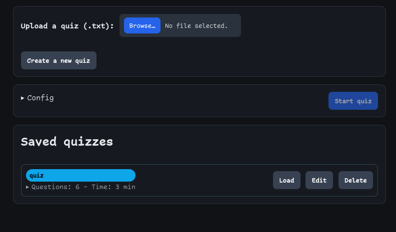
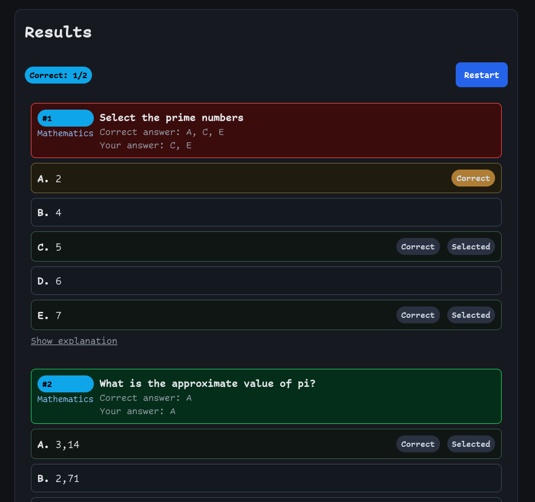
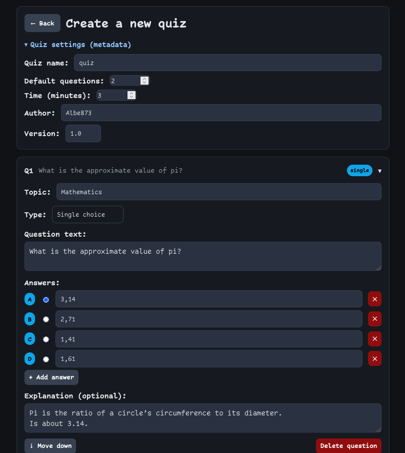

# Simple quiz app in react

A lightweight quiz app built with React. Create and share quizzes using the built-in editor or a simple text file. Play them in the browser, and see instant results in a clean UI. Fully client-side and easy to deploy as a static site.

Hosted on GitHub Pages: https://albe873.github.io/quiz/

home page                     |  question example             | results
:----------------------------:|:-----------------------------:|:-------------------------:
    |  | 

## Prepare a quiz
You can create a quiz in two ways:
1. using the built in gui

2. write a text file, use examples/questions-example.txt for a reference

## Developement and deployment
- clone the repository
- `cd quiz-react`
- `npm install && npm run dev` for local usage and developement
- `npm run build` to have a deployable web app, created in dist folder
